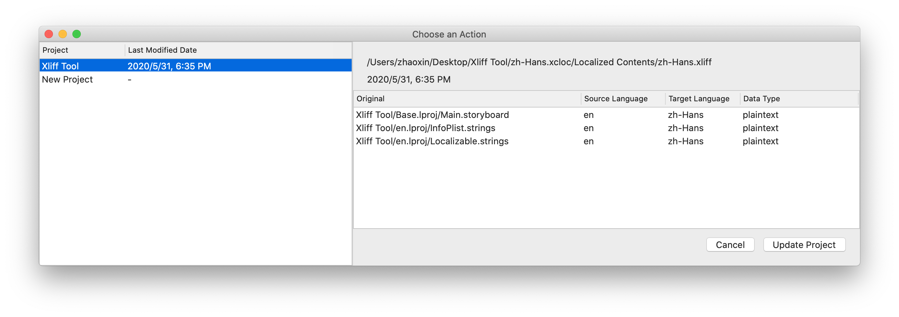
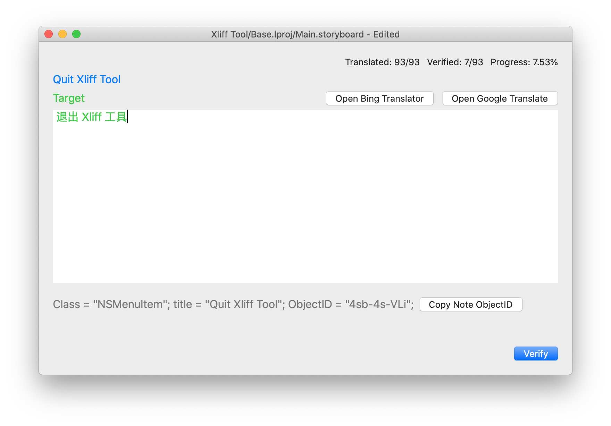

# Xliff Tool
Xliff Tool is an app helping you deal with Xliff files, especially for Xliff 1.2 that Xcode exported. 

## Design Purpose
When developing apps with Xcode for multiple targets, say supporting iOS, watchOS and macOS in one project, there are a lot of pains on translations. You have to provide translations for each platform though most of them are the same. 

After some days, if your add new functions to your app, you have to find the untranslated words and translate them again.

Xliff Tool makes you do your job a lot easier. 

1. Xliff Tool will automatically translate words in other targets when you have translated one in one target. 
2. You then can verify those automatically translated words as you may want to revise them sometimes.
3. Xliff Tool can save results to Xliff file so you can import it back to Xcode.
4. You can choose to skip translated results so only the untranslated words are listed.

## Model
Xliff Tool uses both Xliff file and databases. When you choose to open a Xliff file. Xliff Tool will look its inner databases and sorted the databases by relationship with projects. 

Normally, you should choose the top most project and use "Update Project". 

When updating a project, Xliff Tool will do these operations:

1. Backup original database to backups directory.
2. Merge data in database to the data decoded from the Xliff file.
    1. All translations are decoded from the Xliff file are not verified by default. Xliff Tool compares the project database and Xliff file and marks those identical translations as verified.
    2. For translations newly added from the Xliff file, Xliff Tool looks into the project database to find the translation alike. You can later verify them.
    3. For translations modified from the Xliff file, Xliff Tool looks into the project database and use the previous translation. You can later verify them.

## Backups and Undo
Xliff Tool makes a backup every time you choose "Update Project", and leaves the latest backups in "backups" directory, you can open the "database" directory from "File" menu.

Make sure to do you backup if you want to manually delete or undo databases. 

## Screenshots

## Thanks

[XMLCoder](https://github.com/MaxDesiatov/XMLCoder)

When developing Xliff Tool, I found some issues are related to XMLCoder, [MaxDesiatov](https://github.com/MaxDesiatov) helps me a lot by adding new features that I needed to XMLCoder.

The icon of this app is from below.

Icons made by <a href="https://www.flaticon.com/authors/freepik" title="Freepik">Freepik</a> from <a href="https://www.flaticon.com/" title="Flaticon"> www.flaticon.com</a>

## License
Xliff Tool's license is MIT, except for the icon. As the icon is from the website above mentioned.

## macOS
You will need macOS 10.13 or later to install Xliff Tool.

