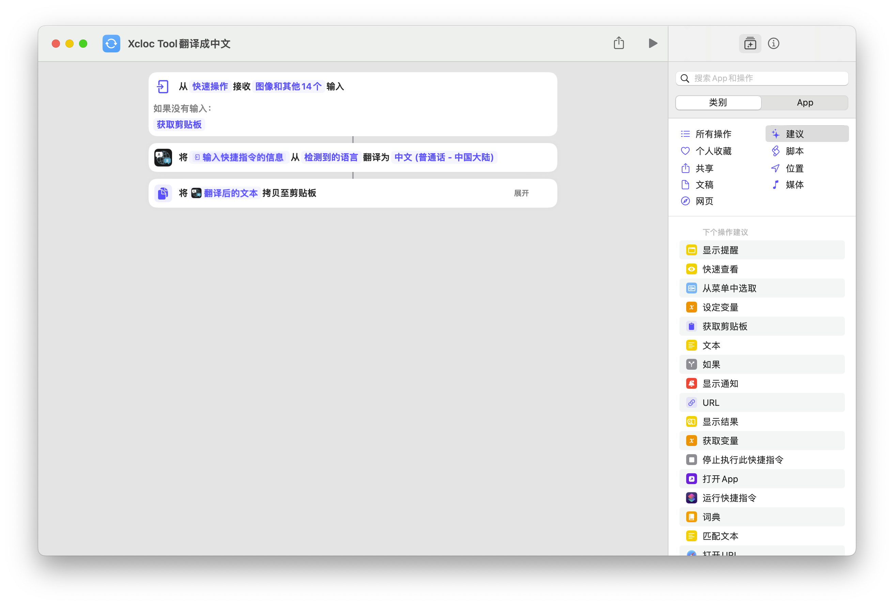
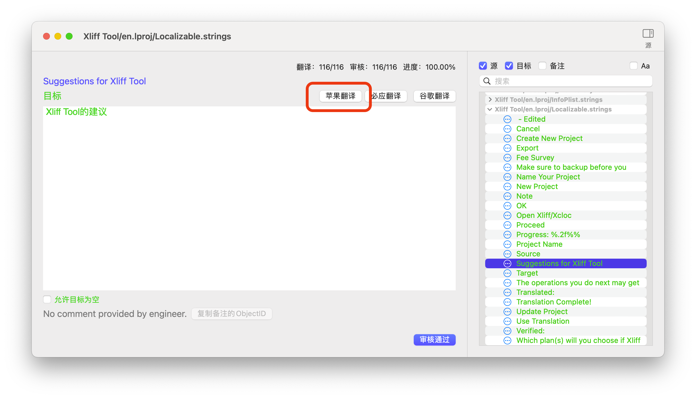
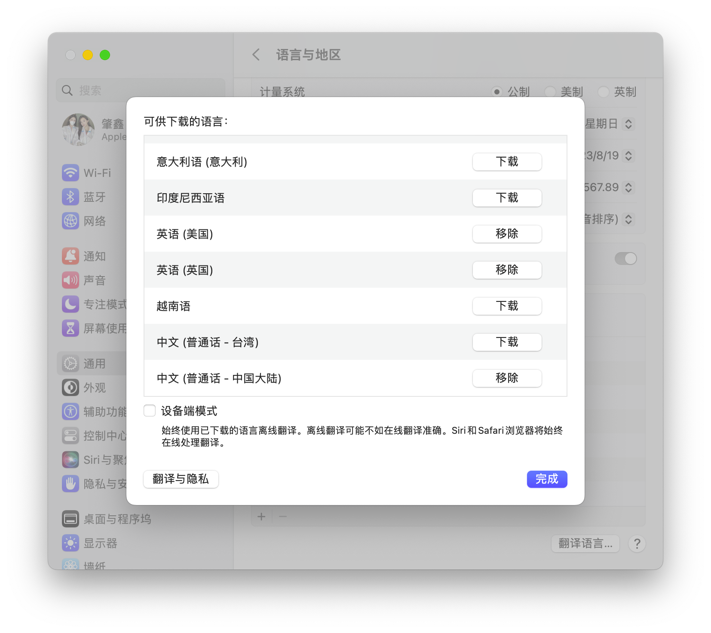

# 使用快捷指令进行翻译
## 步骤
1. 添加快捷指令
2. 在Xliff Tool中选择苹果翻译
3. 按快捷键进行翻译，默认为Fn+Return键

### 1. 添加快捷指令
要使用快捷指令进行翻译，首先需要安装所需要的快捷指令。

> [翻译对应的快捷指令](https://www.icloud.com/shortcuts/08da5e8939fe48deb34a5b8b27ceb3ec)

#### 快捷指令的说明
1. 获得输入
2. 翻译成简体中文
3. 将翻译内容写回剪贴板

### 2. 在Xliff Tool中选择苹果翻译

### 3. 按快捷键进行翻译，默认为Fn+Return键
你也可以自己在快捷指令中修改这个快捷键为你自己希望的其他组合。

## 一般故障的解决
### 提示“可能是不支持的语言”
第二步的翻译，有时会提示“可能是不支持的语言”的错误。这个错误可以通过一下方式尝试解决：

1. 将“检测到的语言”更改为特定语言。比如你已经知道你要尽兴的是英译汉，那么就可以将其改为英文。这样还可以稍微提高一下翻译的速度。
2. 如果改完之后，提示“远端服务器”错误。那么就不是你的问题了，是苹果服务器的问题。此时，可以通过下载翻译包的方式进行解决。

#### 下载翻译包
1. 打开“系统设置…”，通用，语言和地区，拖到最下面，点击右下角的“翻译语言…”。
2. 点击对应的语言包，比如我常用的是英译汉，就选择了，英语（美国）、英语（英国）、中文（普通话-中国大陆）进行下载。

下载完成后，如果远端服务器出现问题，就会启用本地翻译。如果你像直接用本地翻译，可以勾选“设备端模式”，不过这样翻译的准确率会差一些。

## 可能存在的其它问题
此方法适用剪贴板来进行数据的传递。因此，有可能受到其他应用的打扰。如果遇到干扰，可以先选择取消关闭窗口，然后再重新打开来再次进行翻译。